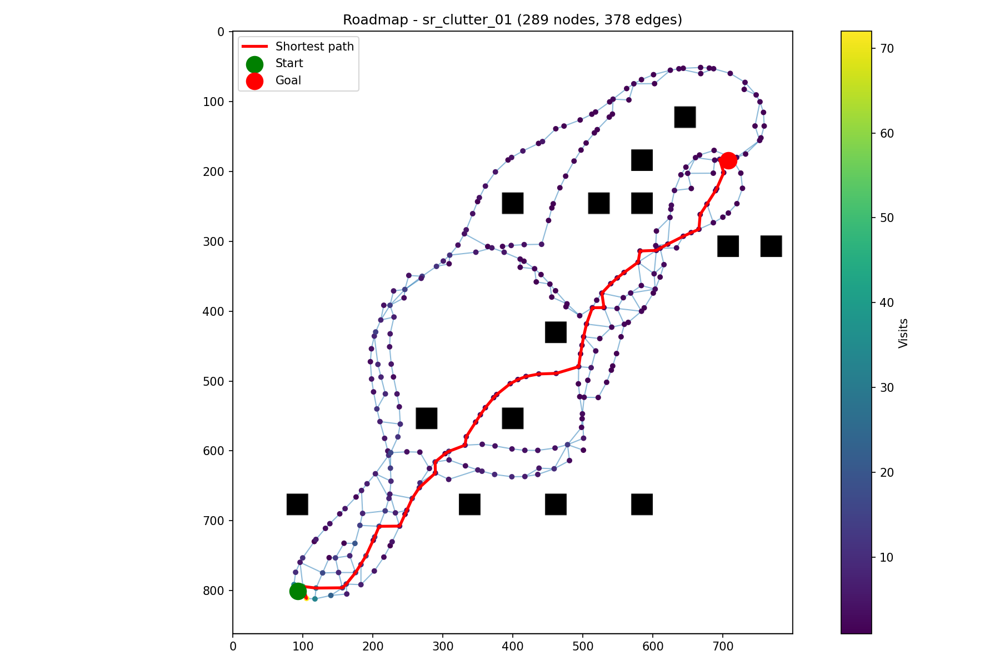

# 🎯 BOW-Connect Planner

This work presents BOWConnect, a bidirectional parallel kinodynamic motion planner that addresses three fundamental limitations of existing sampling-based methods: sample inefficiency in high-dimensional state spaces, unreliable cost heuristics under dynamic constraints, and poor performance in narrow passage environments. Unlike classical planners that rely on random control sampling and geometric distance heuristics, BOWConnect integrates Bayesian Optimization over Windows (BOW) as a learning-based steering function within a parallel tree-based exploration framework, enabling each worker to learn local cost maps and constraints to guide sampling toward dynamically feasible and collision-free controls. A bidirectional architecture simultaneously grows forward and backward trees from the start and goal regions in parallel threads, with a spatial hashing mechanism enabling fast connection queries and a boundary value problem solver generating kinodynamically consistent bridge trajectories. Extensive evaluations across ten benchmark environments demonstrate that BOWConnect achieves 100\% success while delivering the fastest or near-fastest planning time in complex scenarios, including narrow passages and non-convex spaces where state-of-the-art planners fail or degrade substantially. Real-world deployment on a ground vehicle and a quadrotor confirms real-time planning with no collisions.

[](https://bow-web.github.io)
[](https://isocpp.org/)
[](https://python.org/)

---

## 🛠️ Quick Start

### 1. Install Dependencies

#### C++ (Ubuntu/Debian)

```bash
sudo apt update
sudo apt install build-essential cmake git \
    libeigen3-dev libyaml-cpp-dev libnlopt-dev libnlopt-cxx-dev
```

#### Python (bindings, visualization, roadmap examples)

All Python dependencies (`numpy`, `matplotlib`, `pyyaml`, `networkx`, `pybind11`) are declared in `pyproject.toml`:

```bash
pip install -e .
```

### 2. Build the Project

```bash
cmake -B build
cmake --build build -j$(nproc)
```

This builds the `bow_connect_parallel` executable and, when pybind11 is available, the `bow_connect` Python module (`build/bow_connect.cpython-*.so`). Set `-DBUILD_PYTHON_BINDINGS=OFF` to skip the module.

---

## 🏃 Running

Pass a test environment (path relative to the repo root) to `run.sh`:

```bash
./run.sh test/ugv/sr_bugtrap_01.yaml
```

The script:

1. Runs the `bow_connect_parallel` planner from `build/` on the given environment
2. Writes the solution trajectory to `build/trajectory.csv`
3. Plots the trajectory over the environment map with `traj_viewer.py`

---

## 🐍 Python Bindings

The `bow_connect` module wraps the planner for Python. The constructor takes an environment YAML config, and `plan()` takes start/goal configurations and returns the solution trajectory as a NumPy array:

```python
import bow_connect

planner = bow_connect.BOWConnectPlanner("../test/ugv/sr_clutter_01.yaml")

traj = planner.plan(
    start=[-11.5, -1.00375, 0.785398],  # x, y, theta
    goal=[-1.5, -11.00375],             # x, y
    solver_time=30.0,                   # seconds; <= 0 uses config value
    optimize=True,                      # shortcut/smooth the raw trajectory
    verbose=False,
)
# traj: numpy array of shape (N, 5), rows are [x, y, theta, v, omega]
```

`plan()` raises `RuntimeError` if no solution is found within the time budget. The GIL is released while the planner's worker threads run.

### Examples

Run the examples from the `python/` directory (map paths in the configs are relative to it):

```bash
cd python

# Plan once and visualize the trajectory with traj_viewer.py
python3 example.py [--env ../test/ugv/sr_clutter_01.yaml] [--output traj.png]

# Run the planner n times and merge all trajectories into a roadmap graph
python3 roadmap_example.py -n 8 --solver-time 10 [--output roadmap.png]
```

`roadmap_example.py` builds a Python analogue of `bow::MotionTree` (`src/planner/MotionTree.cpp`): every state is snapped to a grid cell (cell size = `robot_radius`, like `MotionTree::hashState`) so overlapping trajectories share nodes, and consecutive states become weighted edges of a `networkx` graph. Dijkstra then extracts the shortest start-to-goal path through the combined roadmap:



---

## 🔍 Environment Files

Test environments live in `test/ugv/` (e.g., `sr_bugtrap_01.yaml`, `sr_clutter_01.yaml`, `intel.yaml`). Each YAML file defines scenario-specific parameters — map image, obstacles, start/goal states, and planner configuration.

---

## 📊 Results & Publications

Detailed results and analysis are available on our website:

🌐 [bow-connect.github.io](https://bow-connect.github.io)

---

## 📚 Citation

```bibtex
@inproceedings{raxit2026bowconnect,
  author    = {Raxit, Sourav and Newaz, Abdullah Al Redwan and  Fuentes, Jose and Bobadilla, Leonardo},
  title     = {{BOWConnect}: Parallel Bayesian Optimization over Windows with Learned Local Cost Maps for Sample-Efficient Kinodynamic Motion Planning},
  booktitle = {IEEE/RSJ International Conference on Intelligent Robots and Systems (IROS)},
  year      = {2026},
  pages     = {1--8},
  publisher = {IEEE}
}
```

---

<div align="center">

**🌐 [Website](https://bow-connect.github.io)** • **📧 [Support](mailto:unoairlab@gmail.com)** • **🐛 [Issues](https://github.com/AiRLab-UNO/bowConnect/issues)**

</div>
